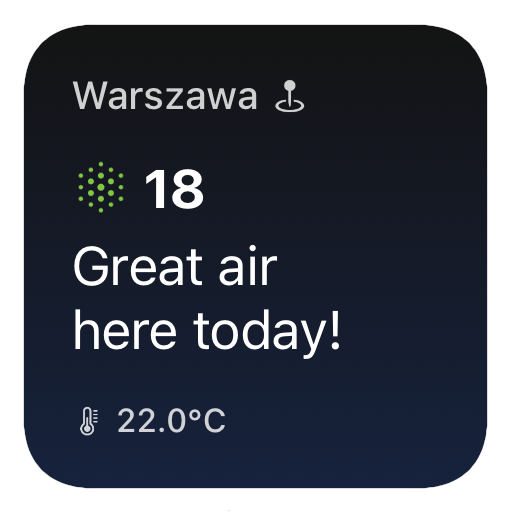

# airly-aqi-scriptable-widget

[Scriptable](https://scriptable.app) app widget that displays [Airly](https://airly.org/en/) sensor data from the nearest sensor station.

    

## How to use it

To use this widget, add a new script in the Scriptable app, paste in the contents of [airly-aqi.js](airly-aqi.js), and set your Airly API key. You can get an API key by registering at [developer.airly.org](https://developer.airly.org/).

You can run the script directly from the app, add a new small or medium widget to your home screen, or ask Siri about the air quality.

The widget uses Location Services to find the nearest Airly sensor station. If that is not working for you, you can set the Airly station ID manually by tapping and holding on the widget, choosing Edit Widget, and then entering the ID in the Parameter field.

## Known issues

> The operation couldn’t be completed. (kCLErrorDomain error 1.)

This error occurs when the Scriptable app was denied access to Location Services. Grant the necessary permission: Go to Settings → Privacy → Location Services → Scriptable, select While Using the App or Widgets, and toggle Precise Location.
